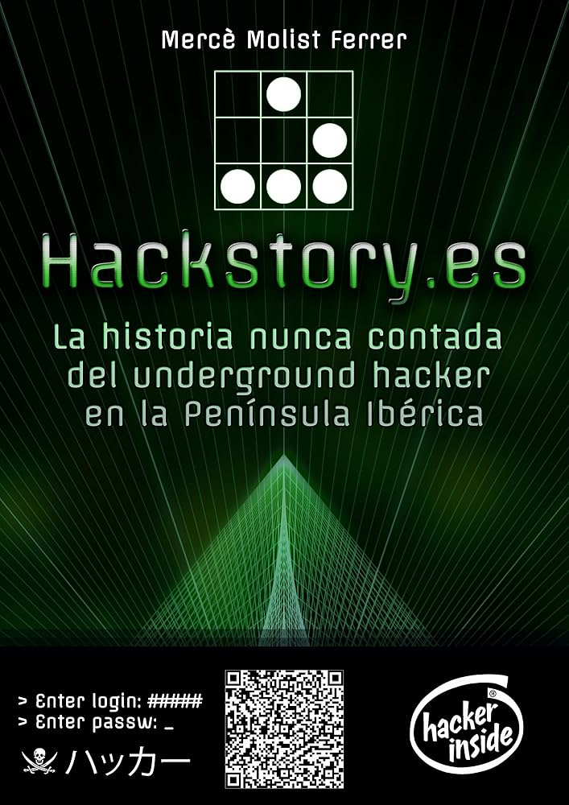

+++
title = "Mi mención en Hackstory.es"
date = 2026-07-19
description = "De los inicios de la web a las páginas de la historia: Mi mención en Hackstory.es"

[taxonomies]
tags = ["showcase", "tutorial", "FAQ"]

[extra]
pinned = true
quick_navigation_buttons = true
+++

Corría el año 2000. La internet que conocemos hoy estaba en pañales, los módems de 56k musicalizaban nuestras tardes y la curiosidad por entender cómo funcionaban las redes por dentro era un terreno puramente subterráneo. En ese ecosistema nació **MefhigosetH**, el proyecto personal con el que di mis primeros pasos en el apasionante mundo de la seguridad informática.

Lo que empezó como un espacio de aprendizaje, experimentación y documentación de vulnerabilidades de la época, terminó convirtiéndose en un granito de arena para la comunidad hispana de hacking de aquellos años.

Hoy, más de dos décadas después, es un orgullo ver que ese esfuerzo quedó registrado en la historia oficial de nuestra comunidad.

## 📖 La mención en Hackstory

El reconocido libro **[Hackstory.es](https://hackstory.es/)**, escrito por la periodista Mercè Molist —una de las mayores cronistas del hacking en España y Latinoamérica—, repasa los hitos, las comunidades y los sitios web que sentaron las bases de la ciberseguridad en nuestra región.

Es una enorme satisfacción encontrar que **MefhigosetH** está indexada y mencionada como uno de los sitios de referencia de la época dorada del underground hispano.

> "Ver tu propio proyecto del año 2000 citado en un libro que funciona como el archivo histórico del hacking en español es un recordatorio de dónde vengo y por qué sigo apasionado por esto."

## 🛠️ Lo que MefhigosetH me enseñó (y sigue vigente)

Mirando hacia atrás, las tecnologías han cambiado radicalmente, pero la mentalidad (*mindset*) sigue siendo exactamente la misma. Aquellas largas noches del año 2000 programando, auditando y rompiendo cosas en entornos controlados me dejaron tres lecciones de por vida:

*   **Curiosidad insaciable:** No basta con saber que algo funciona; hay que entender *por qué* funciona y cómo podría fallar.
*   **Compartir el conocimiento:** La filosofía de las primeras comunidades de seguridad se basaba en el código abierto y los 'ezines' (revistas electrónicas). Hoy sigo creyendo que la seguridad se construye en comunidad.
*   **Evolución constante:** El software cambia, los vectores de ataque mutan, pero la persistencia del analista es lo que marca la diferencia.

Si querés charlar sobre cómo evolucionó la seguridad desde la época de los *exploits* artesanales hasta la automatización y la inteligencia artificial de hoy, **[¡conectemos en LinkedIn!](#)**