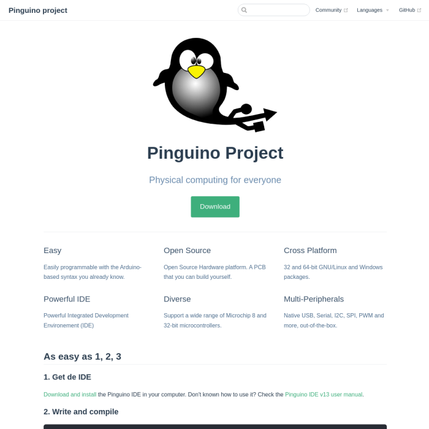

+++
title = "Pinguino Project"
description = "Physical computing for everyone"
weight = 1

[taxonomies]
tags = ["open-source"]

[extra]
local_image = "projects/pinguino-project/pinguino_cc.png"
+++

El proyecto Pinguino PIC es una plataforma de desarrollo de hardware y software de código abierto basada en microcontroladores PIC de Microchip, diseñada para ser una alternativa libre y compatible con el entorno de Arduino sin necesidad de un programador externo.

### [Sitio web](https://pinguinoide.github.io) | [Código fuente](https://github.com/pinguinoide) {.centered-text}

## Features

* **Basado en microcontroladores PIC**: Utiliza chips de Microchip (como el PIC18F2550 o el PIC18F4550) en lugar de los AVR de AVR/Atmel que usa Arduino tradicional.
* **USB nativo**: Al contar con soporte USB integrado en el hardware, se conecta directamente a la computadora para programarse y comunicarse sin chips conversores adicionales.
* **Cargador de arranque (Bootloader) propio**: No requiere de un programador físico externo (como un JTAG o Pickit) para subir el código; el microcontrolador se programa a sí mismo a través del puerto USB.
* **IDE multiplataforma y libre**: Cuenta con su propio entorno de desarrollo basado en Python, compatible con Windows, Linux y macOS.
* **Lenguaje basado en C/C++**: Su sintaxis y funciones principales (como digitalWrite o delay) son prácticamente idénticas a las de Arduino, lo que facilita enormemente la migración de código.
* **Compilador de código abierto**: A diferencia de las herramientas oficiales de Microchip de la época, utiliza compiladores totalmente libres como SDCC (Small Device C Compiler) para arquitecturas de 8 bits.

## Project Evolution

Comencé mi camino en este proyecto de código abierto como un usuario activo. Con el tiempo, pasé a colaborar estrechamente en el desarrollo del código y las traducciones, hasta asumir un rol clave en la administración general del proyecto y sus repositorios en GitHub.

**Contribuciones y logros clave:**
* **Automatización de despliegues:** Desarrollo de las primeras versiones del instalador nativo para Windows y creación del script de instalación automatizada para entornos GNU/Linux.
* **Modernización web:** Lideré la migración completa del sitio web oficial hacia arquitecturas modernas, primero implementando VuePress y recientemente evolucionando la plataforma a VitePress para optimizar el rendimiento y la documentación.
* **Mantenimiento y Gobernanza:** Gestión integral de la organización en GitHub, coordinando flujos de trabajo, revisión de código y administración de repositorios.